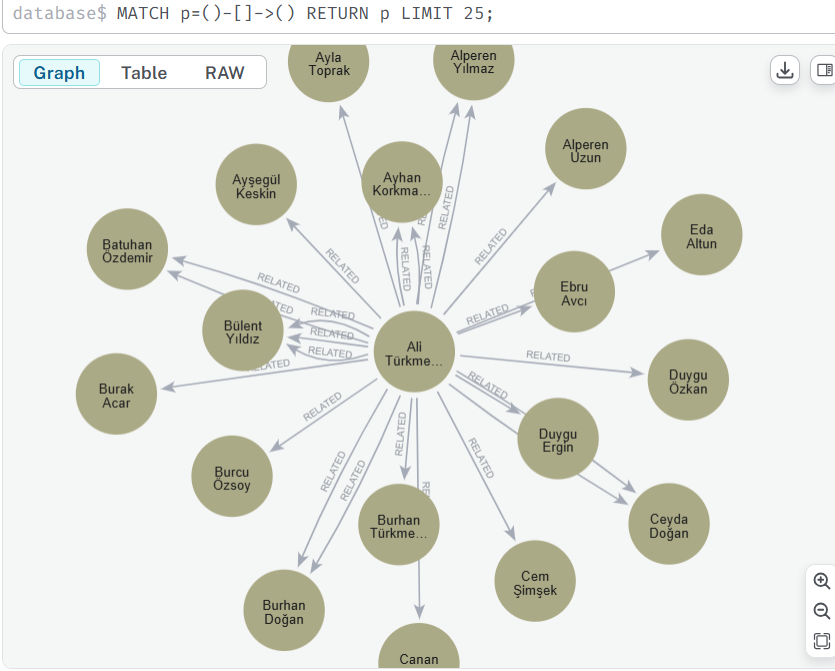
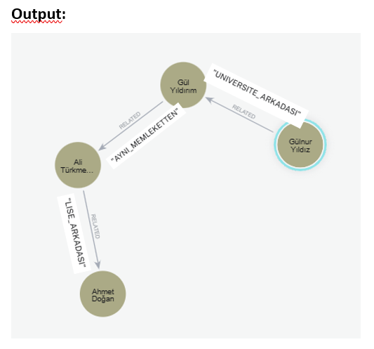
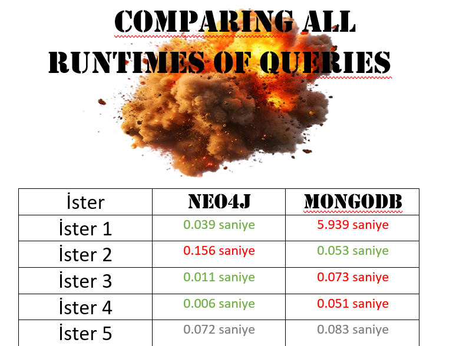
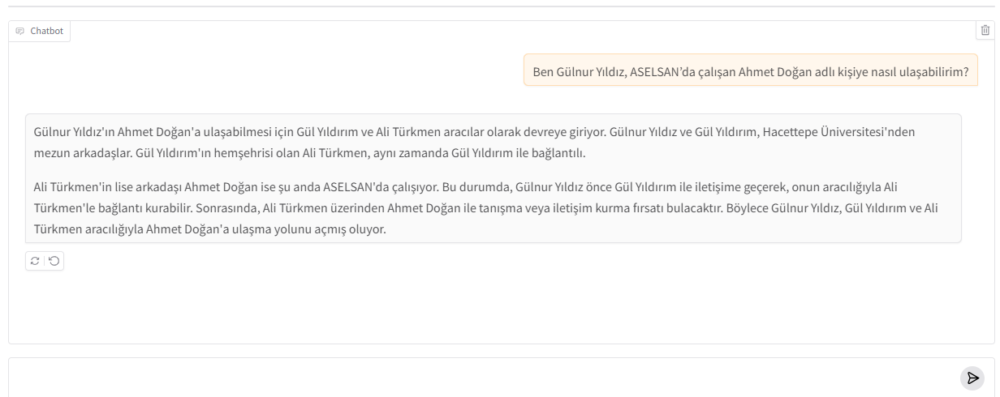

# BioLinkGraph: Relationship Extraction from Biographical Data Using LLMs and Graph Databases

This project implements a full pipeline to generate, analyze, and visualize relationships between fictional people based on biographical documents. Using **OpenAI API**, **Neo4j**, and **MongoDB**, the project extracts meaningful relationships such as shared birthplace, education, and workplaces. The resulting graph structure enables rich query capabilities and insight discovery.



## Project Pipeline Overview

### 1. **Biographical Text Generation**

We generated **280 fictional biographies** using the OpenAI API with GPT-4o. Each biography included detailed life history such as:

* Place and date of birth
* Education (primary to postgraduate)
* Career history and institutions
* Publications, family members, hobbies

<details>
<summary>📄 Example Biography: Akın Doğan</summary>

### Akın Doğan: Endüstriyel Robotik ve Yapay Zeka Uzmanı

**Erken Yaşam ve Kökler**
Akın Doğan, 15 Haziran 1989 tarihinde Bursa'da dünyaya gelmiştir. Çocukluk yılları, sanayi ve doğanın iç içe geçtiği Bursa'da, özellikle mekanik oyuncaklara ve elektronik cihazlara duyduğu merakla geçmiştir. Küçük yaşlardan itibaren parçaları söküp takma, bozulan aletleri tamir etmeye çalışma gibi ilgi alanları gelecekteki kariyerinin sinyallerini vermiştir. İlköğretimini Bursa Osmangazi İlkokulu'nda 1996-2000 yılları arasında tamamlamıştır.

**Eğitim Yılları**
Ortaokul eğitiminin ardından, fen bilimlerine olan üstün yeteneği sayesinde Ankara Fen Lisesi'ni kazanarak 2002 yılında Ankara'ya taşınmıştır. Ankara Fen Lisesi'nde 2002-2006 yılları arasında lise eğitimini tamamlamış, özellikle robotik kulübünde aktif rol alarak ulusal yarışmalarda dereceler elde etmiştir.
Yükseköğrenim için Türkiye'nin en köklü mühendislik fakültelerinden biri olan Orta Doğu Teknik Üniversitesi (ODTÜ) Elektrik ve Elektronik Mühendisliği bölümüne girmiştir. ODTÜ'deki lisans eğitimini 2007-2011 yılları arasında başarıyla tamamlamış, özellikle kontrol sistemleri ve robotik alanında derinlemesine bilgi edinmiştir.
Lisans eğitiminin hemen ardından, Hacettepe Üniversitesi'nde Yapay Zeka ve Robotik Anabilim Dalı'nda yüksek lisans programına başlamış ve 2011-2013 yılları arasında bu programı tamamlamıştır. Yüksek lisans tezi, "Gelişmiş Yapay Zeka Algoritmaları ile Endüstriyel Robot Kolu Kontrol Sistemlerinin Optimizasyonu" başlığını taşımaktaydı.

**Profesyonel Kariyer**
Akın Doğan'ın profesyonel kariyeri, yüksek lisans eğitimi devam ederken, Türkiye'nin savunma sanayii devlerinden **ASELSAN**'da R&D Mühendisi olarak part-time çalışmaya başlamasıyla şekillenmiştir. 2010 yılında başladığı bu görevde, özellikle insansız sistemler ve robotik prototip geliştirme projelerinde aktif rol almıştır. ASELSAN'daki tam zamanlı görevine 2011 yılında başlamış ve 2014 yılına kadar burada kritik projelerde yer almıştır. Bu dönemde özellikle otonom navigasyon ve görüntü işleme algoritmaları üzerine yoğunlaşmıştır.

2014 yılında, savunma ve havacılık sektöründeki deneyimini genişletmek amacıyla Türk Havacılık ve Uzay Sanayii A.Ş. (TAI)'ye transfer olan Akın, burada Kıdemli Robotik Mühendisi olarak görev yapmıştır. 2014-2019 yılları arasında TAI'de, uçak üretim süreçlerinde kullanılan robotik otomasyon sistemlerinin tasarımı ve entegrasyonundan sorumlu olmuş, bu alanda birçok inovatif çözümün geliştirilmesine liderlik etmiştir.

2019 yılında, endüstriyel otomasyon sektörüne geçiş yaparak İstanbul merkezli, hızla büyüyen bir teknoloji şirketi olan "İleri Otomasyon Teknolojileri A.Ş."de Robotik ve Yapay Zeka Çözümleri Direktörü olarak göreve başlamıştır. Bu pozisyonda, üretim tesisleri için yenilikçi robotik ve yapay zeka tabanlı otomasyon çözümleri geliştiren ekiplere liderlik etmektedir.

**Akademik Çalışmalar**
Akın Doğan, aktif profesyonel kariyerinin yanı sıra akademik alanda da katkılar sunmuştur:
*   Doğan, A., Yılmaz, E. (2012). "Adaptive Control of Robotic Manipulators Using Reinforcement Learning", *International Journal of Robotics and Automation*, Cilt 27, Sayı 3, s. 210-225.
*   Doğan, A., Can, S. (2014). "Real-time Object Recognition for Autonomous Navigation Systems in Unstructured Environments", *Journal of Defense Industry Applications*, Cilt 8, Sayı 1, s. 45-60.

**Sosyal Sorumluluk ve Etkiler**
Akın Doğan, genç mühendislere mentorluk yapmaya büyük önem vermektedir. Özellikle ODTÜ ve Hacettepe Üniversitesi'nde düzenli olarak seminerler vermekte, öğrencilere robotik ve yapay zeka alanındaki tecrübelerini aktarmaktadır. Ayrıca, "Geleceğin Mühendisleri Derneği"nin kurucu üyelerinden biri olup, gençlerin STEM alanlarına ilgisini artırmak için çeşitli projelerde gönüllü olarak yer almaktadır.

**Kişisel Yaşam**
Akın Doğan, 2015 yılında finans uzmanı Elif Kaya ile hayatını birleştirmiştir. Çiftin iki çocuğu bulunmaktadır: 2017 doğumlu Deniz ve 2019 doğumlu Can. Şu an Ankara'da yaşamaktadır. Hobileri arasında drone fotoğrafçılığı, dağ yürüyüşleri ve robotik kodlama projeleri geliştirmek yer almaktadır. Yeni teknolojileri takip etmeye ve karmaşık problemler üzerine düşünmeye olan düşkünlüğü, kişisel yaşamında da devam etmektedir.

**Mevcut Çalışmalar ve Gelecek Hedefler**
Akın Doğan, "İleri Otomasyon Teknolojileri A.Ş." bünyesinde, özellikle Endüstri 4.0 dönüşümü kapsamında akıllı fabrika sistemleri ve işbirlikçi robot (cobot) teknolojileri üzerine yoğunlaşmaktadır. Gelecekteki hedefleri arasında, Türkiye'nin robotik ve yapay zeka alanındaki yetkinliklerini uluslararası arenada temsil edecek öncü projelere liderlik etmek ve genç yeteneklerin bu alanlarda gelişmesine daha fazla katkı sağlamaktır.

</details>

#### NOTE: THESE INDIVIDUALS WERE ENTIRELY GENERATED BY ARTIFICIAL INTELLIGENCE FOR EDUCATIONAL AND PROJECT DEVELOPMENT PURPOSES BY INTERNS. THEY DO NOT REPRESENT REAL PEOPLE IN ANY WAY.
---

### 2. **Named Entity Recognition (NER)**

Each biography was passed through another OpenAI API call to extract structured information via NER. This resulted in JSON documents like:

```json
{
  "ad": "Akın Doğan",
  "dogum_yeri": "Bursa",
  "dogum_tarihi": "15.06.1989",
  "yaş": 34,
  "ilkokul_yılları": "1996-2000",
  "ilkokul": "Bursa Osmangazi İlkokulu",
  "lise": "Ankara Fen Lisesi",
  "lise_yılları": "2002-2006",
  "universite": "Orta Doğu Teknik Üniversitesi",
  "üniversite_yılları": "2007-2011",
  "bolum": "Elektrik ve Elektronik Mühendisliği",
  "yuksek_lisans": "Hacettepe Üniversitesi",
  "yüksek_lisans_yılları": "2011-2013",
  "doktora": null,
  "doktora_yılları": null,
  "meslegi": "Robotik ve Yapay Zeka Uzmanı",
  "calistigi_kurumlar": ["ASELSAN", "Türk Havacılık ve Uzay Sanayii A.Ş.", "İleri Otomasyon Teknolojileri A.Ş."],
  "çalışma_başlangıç_yılları": ["2010-2014", "2014-2019", "2019-null"],
  "kurdugu_girisim_ve_dernekler": ["Geleceğin Mühendisleri Derneği"],
  "girişim_kuruluş_yılları": ["null"],
  "memleket": "Bursa",
  "yasadigi_sehir": "Ankara",
  "hobiler": ["drone fotoğrafçılığı", "dağ yürüyüşleri", "robotik kodlama projeleri geliştirmek"],
  "es": "Elif Kaya",
  "cocuklar": ["Deniz", "Can"],
  "akademik_yayinlar": [
    "Adaptive Control of Robotic Manipulators Using Reinforcement Learning",
    "Real-time Object Recognition for Autonomous Navigation Systems in Unstructured Environments"
  ],
  "yayın_yılları": ["2012", "2014"],
  "dosya_adi": "akin_dogan.md"
}
```

Over **280 JSON files** were produced, each containing dozens of attributes for detailed analysis.

---

### 3. **Relationship Extraction (Rule-Based)**

Using a custom notebook (`3_not_llm_relation_extract.ipynb`), relationships between individuals were inferred based on overlapping attributes, such as:

* `AYNI_MEMLEKETTEN` (same hometown)
* `MESLEKTAŞ` (same profession)
* `UNIVERSITE_ARKADAŞI` (same university)
* `AYNI_KURUMDA_CALISMIS` (worked at same institution)

The relationships were stored in a separate JSON file:

```json
{
  "source": "Akın Doğan",
  "target": "Ali Türkmen",
  "relations": ["AYNI_KURUMDA_CALISMIS", "MESLEKTAŞ"]
}
```

---

### 4. **Graph Database Integration with Neo4j**

Using the extracted JSON files, all individuals (`Person` nodes) and their relationships (`RELATED` edges) were successfully imported into **Neo4j** using the following Cypher query:

```cypher
CALL apoc.load.json("file:///structured_bios_new_english_fixed.json") YIELD value
MERGE (p:Person {name: value.ad})
SET
  p.ad = value.ad,
  p.dogum_yeri = value.dogum_yeri,
  p.yas = value.yas,
  p.ilkokul = value.ilkokul,
  p.ilkokul_yillari = value.ilkokul_yillari,
  p.lise = value.lise,
  p.lise_yillari = value.lise_yillari,
  p.universite = value.universite,
  p.universite_yillari = value.universite_yillari,
  p.bolum = value.bolum,
  p.yuksek_lisans = value.yuksek_lisans,
  p.yuksek_lisans_yillari = value.yuksek_lisans_yillari,
  p.yasadigi_sehir = value.yasadigi_sehir,
  p.hobiler = [h IN value.hobiler WHERE h IS NOT NULL],
  p.cocuklar = [c IN value.cocuklar WHERE c IS NOT NULL],
  p.calistigi_kurumlar = [x IN value.calistigi_kurumlar WHERE x IS NOT NULL],
  p.calisma_yillari = [x IN value.calisma_yillari WHERE x IS NOT NULL],
  p.dosya_adi = value.dosya_adi
FOREACH (_ IN CASE WHEN value.doktora IS NOT NULL THEN [1] ELSE [] END |
  SET p.doktora = value.doktora
)
FOREACH (_ IN CASE WHEN value.doktora_yillari IS NOT NULL THEN [1] ELSE [] END |
  SET p.doktora_yillari = value.doktora_yillari
)
```

```cypher
CALL apoc.load.json("file:///automated_relationships.json") YIELD value
UNWIND value.relations AS rel
MATCH (a:Person {name: value.source})
MATCH (b:Person {name: value.target})
MERGE (a)-[:RELATED {type: rel}]->(b)
MERGE (b)-[:RELATED {type: rel}]->(a)
```

> ⚠️ **Important:** To successfully run this query, make sure to place your `.json` files (e.g., `structured_bios_new_english_fixed.json`) into the following directory so Neo4j can access them:

```
C:\Users\aalperen.arda\.Neo4jDesktop2\Data\dbmss\dbms-57535359-9211-4bff-90f6-bcb6408c711c\import
```

This is the import directory used by Neo4j Desktop. Files must be located here for `apoc.load.json` to work properly.

A wide range of **Cypher queries** were written to explore:

* Multi-hop connections
* Institutional overlaps
* Educational intersections
* Degree of separation between people


#### Example Use Case Query

**Question**: “How can I reach Ahmet Doğan who works at ASELSAN, starting from Gülnur Yıldız?”
**Cypher**:

```cypher
MATCH p=(source:Person {ad: "Gülnur Yıldız"})-[:RELATED*1..3]->(target:Person {ad: "Ahmet Doğan"})
WHERE "ASELSAN" IN target.calistigi_kurumlar
RETURN p LIMIT 1
```


---

### 5. **MongoDB vs Neo4j Query Runtime Comparison**

To test graph traversal performance, we implemented equivalent queries in **MongoDB** and compared their runtime with Neo4j. The results are illustrated below:



Neo4j significantly outperformed MongoDB in multi-hop and relationship-heavy queries, highlighting its efficiency for graph workloads.

---

### 6. **Intelligent Chat Interface (LLM + Graph + Gradio)**

Finally, we built a chatbot that:

* Accepts natural language queries
* Converts them to Cypher queries via OpenAI API
* Executes the query on Neo4j
* Uses OpenAI again to generate natural language answers

This chatbot was deployed using **Gradio** for a seamless UI.



---

## Key Files

| File                                     | Description                                                      |
| ---------------------------------------- | ---------------------------------------------------------------- |
| `structured_bios_new_english_fixed.json` | Contains all structured biography data generated via NER         |
| `automated_relationships.json`           | Contains all automatically inferred relationships between people |
| `1_auto-writer.ipynb`                    | Generates random biographies using the OpenAI API                |
| `2_named_entity_recognition.ipynb`       | Extracts structured data from biographies using NER              |
| `3_not_llm_relation_extract.ipynb`       | Rule-based relationship extraction between individuals           |
| `4_gradio_chatbot.ipynb`                 | Creates a Gradio chatbot with Neo4j + LLM-based explanations     |
| `use_cases_and_comparing.docx`           | Documents use cases and compares Neo4j vs MongoDB runtimes       |

---

## Technologies Used

| Technology     | Purpose                         |
| -------------- | ------------------------------- |
| **OpenAI API** | Text generation & NER           |
| **Python**     | Data processing and scripting   |
| **Neo4j**      | Graph database and querying     |
| **MongoDB**    | NoSQL database for benchmarking |
| **Gradio**     | Chatbot interface               |
| **Pandas**     | Data manipulation               |

---

## 🙌 Acknowledgements

Special thanks to **Mehmet Ulaş Çakır** and **Emirhan Gül** for their invaluable support and contributions to the project.

For any questions, feel free to contact me at **[alperen.arda.adem22@gmail.com](mailto:alperen.arda.adem22@gmail.com)**


